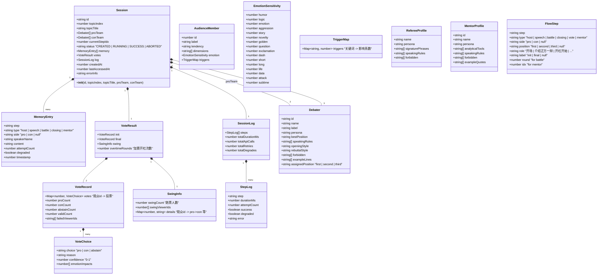
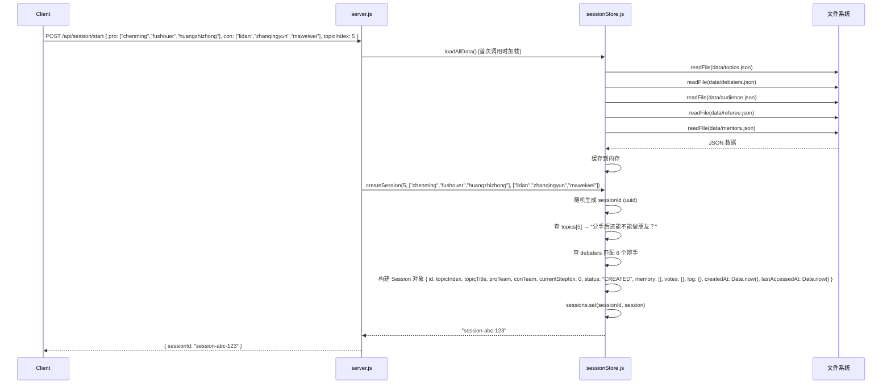
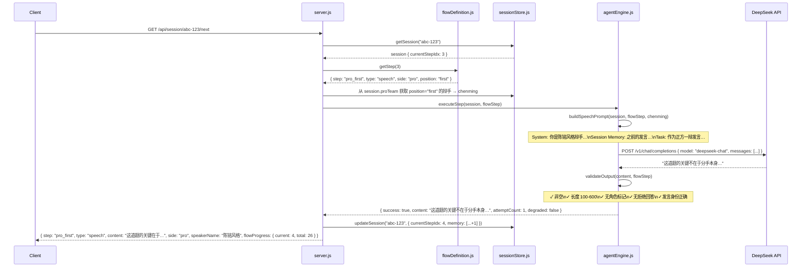
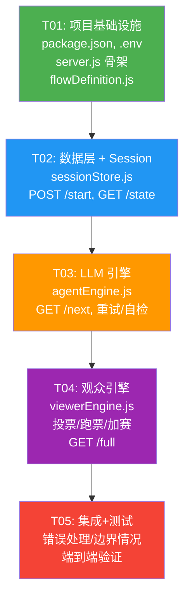

# AI 奇葩说 — 后端系统架构设计

> 架构师：Bob（软件架构师）
> 日期：2026-07-28
> 技术栈：Node.js + Express + DeepSeek API

---

## Part A: 系统设计

---

### 1. 实现方案

#### 1.1 核心难点分析

| 难点 | 描述 | 解决方案 |
|------|------|---------|
| **LLM 可靠性** | DeepSeek API 可能超时/返回空/拒绝回答 | 4 次重试降级策略：3次完整 Prompt → 1次简化 Prompt → 占位文本 |
| **输出质量自检** | LLM 可能跑题、角色混淆、长度不合规 | 每步 5 项自检 + 关键节点深度检查 |
| **30 人投票并发** | 30 观众逐个调 LLM 太慢 | 分 6 批，每批 5 人并行，批间 sleep 500ms |
| **跑票计算** | 需要初投/终投对比，跑票=0触发加赛 | 投票数据结构化存储，支持对比计算 |
| **Session 生命周期** | 多用户并发，30分钟超时清理 | 内存 Map + setInterval 定时扫描 |

#### 1.2 框架和库选择

| 库 | 版本 | 用途 | 理由 |
|----|------|------|------|
| express | ^4.18.0 | HTTP 服务器 | 已存在于 package.json |
| dotenv | ^16.3.0 | 环境变量管理 | 已存在于 package.json |
| cors | ^2.8.5 | 跨域支持 | 前后端分离需要 |
| Node.js 内置 fetch | — | HTTP 调用 DeepSeek API | Node 18+ 原生支持，无需额外依赖 |

#### 1.3 架构模式

采用 **分层架构 + 模块化设计**：

```
┌─────────────────────────────────────────────────┐
│                  路由层 (server.js)                │
│  POST /start │ GET /state │ GET /next │ GET /full │
└──────────────────────┬──────────────────────────┘
                       │
┌──────────────────────▼──────────────────────────┐
│                  编排引擎层                        │
│  server.js 中的 executeNextStep() 循环调度        │
│  根据 FLOW 数组决定调 agentEngine / viewerEngine  │
└──────┬─────────────────────────────┬─────────────┘
       │                             │
┌──────▼──────────┐    ┌─────────────▼──────────┐
│ agentEngine.js   │    │   viewerEngine.js       │
│ Prompt 构建      │    │   观众投票               │
│ LLM 调用 + 重试  │    │   情绪计算               │
│ 输出自检         │    │   跑票统计               │
└──────┬──────────┘    └─────────────┬────────────┘
       │                             │
       └──────────┬──────────────────┘
                  │
┌─────────────────▼──────────────────┐
│         sessionStore.js             │
│  Session CRUD / 数据加载 / 缓存      │
│  30分钟超时清理                      │
└─────────────────┬──────────────────┘
                  │
┌─────────────────▼──────────────────┐
│         data/ (JSON 文件)            │
│  topics.json │ debaters.json │ ...  │
└────────────────────────────────────┘
```

---

### 2. 文件列表

所有文件都在 `/Users/Andy/Desktop/AI的夏天/` 根目录下：

```
./
├── .env                          # 环境变量 (DEEPSEEK_API_KEY)
├── .env.example                  # 环境变量模板
├── package.json                  # 项目配置与依赖
├── data/
│   ├── topics.json               # 20 个辩题
│   ├── debaters.json             # 12 个辩手 Profile
│   ├── audience.json             # 30 个观众 Profile
│   ├── referee.json              # 主持人马东 Profile
│   └── mentors.json             # 2 个导师 Profile
└── server/
    ├── server.js                 # Express 主入口 + 路由 + 主循环调度
    ├── flowDefinition.js         # FLOW 数组 (28 步，纯数据)
    ├── sessionStore.js           # Session CRUD + 数据加载 + 超时清理
    ├── agentEngine.js            # Prompt 构建 + LLM 调用 + 重试 + 自检
    └── viewerEngine.js           # 观众投票 + 情绪计算 + 跑票
```

---

### 3. 数据结构和接口定义

#### 3.1 核心数据结构 (classDiagram)



#### 3.2 模块导出接口

##### `flowDefinition.js`

```javascript
// 纯数据模块，无依赖
const FLOW = [ /* 28 步定义 */ ];

function getFlow()            // → FLOW 数组
function getStep(index)       // → FlowStep | null
function getFlowLength()      // → number (28)
function getStepType(index)   // → "host" | "speech" | "battle" | "closing" | "vote" | "mentor"
function isSpeechStep(step)   // → boolean
function isBattleStep(step)   // → boolean
function isVoteStep(step)     // → boolean
function isMentorStep(step)   // → boolean
function isClosingStep(step)  // → boolean
function isHostStep(step)     // → boolean
```

##### `sessionStore.js`

```javascript
// Session 生命周期管理 + 数据文件加载

// --- 数据文件加载 ---
function loadTopics()                             // → { topics: [{title}], getTopic(index): {title} }
function loadDebaters()                           // → { debaters: [Debater], getById(id): Debater }
function loadAudience()                           // → { audience: [AudienceMember] }
function loadReferee()                            // → RefereeProfile
function loadMentors()                            // → [MentorProfile]
function loadAllData()                            // → { topics, debaters, audience, referee, mentors }

// --- Session CRUD ---
function createSession(topicIndex, proTeamIds, conTeamIds)
  // → string (sessionId)
  // 功能：加载辩题，组建阵容，创建 Session 对象，存入 Map，返回 sessionId

function getSession(sessionId)
  // → Session | null
  // 功能：更新 lastAccessedAt，返回 session，不存在返回 null

function updateSession(sessionId, partialUpdates)
  // → Session | null
  // 功能：合并更新 session（如 currentStepIdx, memory, votes 等）

function deleteSession(sessionId)
  // → void

// --- 内部 ---
function startCleanupTimer()
  // 每 5 分钟扫描一次，清理 lastAccessedAt > 30 分钟的 session
function getExpiredSessions()
  // → string[] (超时 sessionId 列表)
```

##### `agentEngine.js`

```javascript
// Prompt 构建 + LLM 调用 + 输出自检 + 降级重试

// --- 主入口 ---
async function executeStep(session, flowStep)
  // → { success: boolean, content: string, attemptCount: number, degraded: boolean, error: string | null }
  // 功能：根据 flowStep 类型构建 prompt → 调用 LLM → 自检 → 返回结果

// --- Prompt 构建 ---
function buildFullPrompt(session, flowStep)
  // → string (完整 Prompt)
  // 功能：根据步骤类型选择对应的 Prompt 构建策略

function buildHostPrompt(session, flowStep, hostProfile)
  // → string (主持人 Prompt)
function buildSpeechPrompt(session, flowStep, debater)
  // → string (辩手发言 Prompt)
function buildBattlePrompt(session, flowStep, debater, lastOpponentSpeech)
  // → string (开杠 Prompt，包含对方上一轮内容)
function buildClosingPrompt(session, flowStep, debater)
  // → string (结辩 Prompt)
function buildMentorPrompt(session, flowStep, mentor)
  // → string (导师点评 Prompt)
function buildSimplifiedPrompt(session, flowStep)
  // → string (降级版 Prompt，去掉风格约束)

// --- LLM 调用 ---
async function callLLM(prompt, timeoutMs)
  // → { success: boolean, content: string, error: string | null }
  // 功能：调用 DeepSeek API (原生 fetch)，处理超时/错误

// --- 输出自检 ---
function validateOutput(output, flowStep)
  // → { valid: boolean, checks: { nonEmpty, lengthOk, noRoleTag, noRefusal, correctSpeaker }, warnings: string[] }

async function validateBattleResponse(output, session, flowStep)
  // → { valid: boolean, containsKeywords: boolean, matchedKeywords: string[] }
  // 功能：从对方上一轮发言中提取关键词，检查本轮是否包含至少 1 个

// --- 降级策略 ---
function degradePrompt(session, flowStep, attemptCount)
  // → string (第 4 次尝试的简化 Prompt)
function generateFallbackContent(flowStep, session)
  // → string (占位文本)

// --- 工具函数 ---
function extractKeywords(text)
  // → string[] (提取关键词，去掉停用词)
function calculateResponseLength(flowStep)
  // → { min: number, max: number } (当前步骤的字数范围期望)
```

##### `viewerEngine.js`

```javascript
// 观众投票 + 情绪计算 + 跑票统计

// --- 主入口 ---
async function executeVote(session, voteType)
  // → { success: boolean, voteRecord: VoteRecord | null, error: string | null }
  // voteType: "init" | "final"

// --- 投票子流程 ---
async function batchVote(viewers, session, voteType)
  // → VoteRecord
  // 功能：30 人分 6 批，每批 5 人并行调 LLM，批间 sleep 500ms

function prepareVotePrompt(viewer, session, voteType)
  // → string (单个观众的投票 Prompt)
  // 功能：根据观众倾向、维度、情绪敏感度，以及之前的发言历史，构建投票 Prompt

// --- 情绪计算 ---
function calculateEmotionImpact(speechText, viewer)
  // → number[] (16 个情绪维度的得分变化)
  // 功能：对辩手发言进行情感分析，结合观众的情绪敏感度，计算该发言对观众的影响

function calculateViewerPreference(viewer, session, voteType)
  // → { choice: "pro" | "con" | "abstain", confidence: number, reason: string }

// --- 跑票统计 ---
function calculateSwing(initVotes, finalVotes)
  // → SwingInfo
  // 功能：对比初投和终投，统计跑票人数、具体跑票详情

function getSwingViewers(initVotes, finalVotes)
  // → number[] (跑票观众 ID 列表)

// --- 补票机制 ---
function fillDefaultVotes(voteRecord, targetCount)
  // → VoteRecord
  // 功能：有效票不足 20 时，按倾向补默认票
```

##### `server.js` (路由 + 主循环)

```javascript
// --- Express 配置 ---
const app = express();
app.use(cors());
app.use(express.json());

// --- 路由 ---
// POST /api/session/start
async function handleStartSession(req, res)
  // Body: { pro: [debaterId1, debaterId2, debaterId3], con: [debaterId1, ...], topicIndex?: number }
  // 返回: { sessionId: string }

// GET /api/session/:id/state
async function handleGetState(req, res)
  // 返回: { sessionId, topicTitle, proTeam, conTeam, status, currentStep, currentStepName }

// GET /api/session/:id/next
async function handleNextStep(req, res)
  // 读取 session 和 FLOW → 确定当前步骤 → 调用 agentEngine 或 viewerEngine → 存入 memory → 更新 session
  // 返回: { step, type, content, side, speakerName, voteResult?, flowProgress: { current, total } }

// GET /api/session/:id/full
async function handleGetFullTranscript(req, res)
  // 返回: { sessionId, topic, teams, hostOpening, speeches, battles, closings, mentors, votes }

// --- 主循环核心 ---
async function executeNextStep(session)
  // → { ...stepResult }
  // 功能：读取 FLOW[currentStepIdx] → 判断类型 → 分发到 agentEngine.executeStep / viewerEngine.executeVote
  //   - host/speech/battle/closing/mentor → agentEngine.executeStep
  //   - vote → viewerEngine.executeVote
  //   - 完成后 currentStepIdx++，更新 session，处理终止条件判断

function checkAbortConditions(session, stepResult)
  // → { shouldAbort: boolean, reason: string | null }

function checkSwingZero(session, voteResult)
  // → { needsOvertime: boolean }

// --- 启动 ---
// 加载数据 JSON → 启动 cleanup 定时器 → app.listen(3000)
```

---

### 4. 程序调用流程

#### 4.1 完整一集辩论的时序图

```mermaid
sequenceDiagram
    participant Client as 前端
    participant Server as server.js
    participant Flow as flowDefinition.js
    participant Store as sessionStore.js
    participant Agent as agentEngine.js
    participant Viewer as viewerEngine.js
    participant LLM as DeepSeek API

    Note over Client,LLM: === 阶段 1: 创建 Session ===
    Client->>Server: POST /api/session/start { pro, con, topicIndex }
    Server->>Store: createSession(topicIndex, proIds, conIds)
    Store->>Store: loadAllData() [缓存]
    Store->>Store: 生成 sessionId (uuid)
    Store-->>Server: { sessionId }
    Server-->>Client: { sessionId: "abc-123" }

    Note over Client,LLM: === 阶段 2: 循环执行每一步 ===
    loop Each Step in FLOW (28 steps)
        Client->>Server: GET /api/session/abc-123/next
        Server->>Store: getSession("abc-123")
        Server->>Flow: getStep(session.currentStepIdx)
        Flow-->>Server: { step: "host_opening", type: "host", ... }

        alt type = "host" | "speech" | "battle" | "closing" | "mentor"
            Server->>Agent: executeStep(session, flowStep)
            Agent->>Agent: buildFullPrompt(session, flowStep)

            rect rgb(240, 240, 240)
                Note right of Agent: 重试循环 (最多4次)
                loop attempt = 1..3 (完整 Prompt)
                    Agent->>LLM: POST /v1/chat/completions { prompt }
                    LLM-->>Agent: { choices[0].message.content }
                    Agent->>Agent: validateOutput(content, flowStep)
                    alt 验证通过
                        break
                    else 验证失败 && attempt < 3
                        Agent->>Agent: 等待 2s 后重试
                    end
                end
                alt 3次都失败
                    Agent->>Agent: buildSimplifiedPrompt(session, flowStep)
                    Agent->>LLM: POST /v1/chat/completions { simplifiedPrompt }
                    LLM-->>Agent: content
                    Agent->>Agent: validateOutput(content, flowStep)
                    alt 再次失败
                        Agent->>Agent: generateFallbackContent(flowStep)
                    end
                end
            end

            Agent-->>Server: { success, content, attemptCount, degraded }
            Server->>Store: updateSession(id, { memory.push({...}) })

        else type = "vote"
            Server->>Viewer: executeVote(session, flowStep.label)
            rect rgb(240, 240, 240)
                Note right of Viewer: 30人分6批投票
                loop batch of 5 viewers
                    par batch[0] to batch[4] 并行
                        Viewer->>LLM: prepareVotePrompt(viewer, session)
                        LLM-->>Viewer: { choice, reason, confidence }
                    end
                    alt 不是最后一批
                        Viewer->>Viewer: sleep(500ms)
                    end
                end
                Viewer->>Viewer: calculateSwing(initVotes, finalVotes)
            end
            Viewer-->>Server: { voteRecord, success }
            Server->>Store: updateSession(id, { votes: {...} })

            alt runType = "final" AND swingCount === 0
                Server->>Server: 触发加赛开杠
                Server->>Store: updateSession(id, { overtimeRounds++ })
            end
        end

        Server->>Store: updateSession(id, { currentStepIdx: idx+1 })
        Server-->>Client: { step, type, content, side, speakerName, ... }
    end

    Note over Client,LLM: === 阶段 3: 获取完整台本 ===
    Client->>Server: GET /api/session/abc-123/full
    Server->>Store: getSession("abc-123")
    Server-->>Client: { fullTranscript }
```

#### 4.2 Session 创建流程



#### 4.3 单步执行流程（以 speech 为例）



#### 4.4 投票执行流程（vote + 跑票检查）

```mermaid
sequenceDiagram
    participant Server as server.js
    participant Viewer as viewerEngine.js
    participant LLM as DeepSeek API

    Server->>Viewer: executeVote(session, "init")

    loop batch 1: 观众 1-5
        par viewer1 callLLM
            Viewer->>LLM: votePrompt(viewer1)
            LLM-->>Viewer: { choice: "pro", reason: "...", confidence: 0.8 }
        and viewer2 callLLM
            Viewer->>LLM: votePrompt(viewer2)
            LLM-->>Viewer: { choice: "con", reason: "...", confidence: 0.6 }
        and viewer3 callLLM
            Viewer->>LLM: votePrompt(viewer3)
            LLM-->>Viewer: { choice: "pro", reason: "...", confidence: 0.9 }
        and viewer4 callLLM
            Viewer->>LLM: votePrompt(viewer4)
            LLM-->>Viewer: { choice: "abstain", reason: "...", confidence: 0.4 }
        and viewer5 callLLM
            Viewer->>LLM: votePrompt(viewer5)
            LLM-->>Viewer: { choice: "con", reason: "...", confidence: 0.7 }
    end
    Viewer->>Viewer: sleep(500ms)

    loop batch 2..6
        ... 类似批处理 ...
    end

    Viewer->>Viewer: 统计有效票数
    alt 有效票 < 20
        Viewer->>Viewer: fillDefaultVotes(voteRecord, 20)
    end
    Viewer-->>Server: { voteRecord: { proCount: 14, conCount: 12, abstainCount: 4, validCount: 26 }, success: true }
```

---

### 5. 不清楚的地方和假设

#### 5.1 已明确的
- 所有 28 步 FLOW 完全定义
- 6 个数据文件路径和格式已确认
- API Key 为 `sk-8860f97efdcb42e39e689c39868a0778`
- Node 18+ 使用原生 fetch

#### 5.2 假设
1. **辩手阵容分配**：POST 时前端传入 pro/con 各 3 个 debaterId，后端按数组顺序分配 position（顺序即为 first/second/third）
2. **Topic 选择**：前端可指定 topicIndex（0-19），不传则随机
3. **加赛开杠**：跑票=0 时执行 1 轮额外开杠（正方先），然后重新终投。如果再次跑票=0，正常结束并标记
4. **主持人发言**：主持人发言每次重新调 LLM（不是写死的模板）
5. **导师点评**：每个导师独立发言，各调一次 LLM
6. **超时清理**：用 `setInterval` 每 5 分钟检查一次，清理 `lastAccessedAt` 超过 30 分钟的 session
7. **CORS**：前后端分离架构，需添加 cors 中间件
8. **端口**：默认 3000，可通过 `PORT` 环境变量配置
9. **投票分析维度**：观众根据"辩手发言"中的关键词触发 emotion sensitivity 和 triggers 来综合判断

---

## Part B: 任务分解

---

### 6. 所需依赖包

```
express@^4.18.0        # HTTP 服务器 (已有)
dotenv@^16.3.0         # 环境变量 (已有)
cors@^2.8.5            # 跨域支持 (需要安装)
uuid@^9.0.0            # 生成 sessionId (需要安装)
```

**package.json 更新后：**
```json
{
  "dependencies": {
    "express": "^4.18.0",
    "dotenv": "^16.3.0",
    "cors": "^2.8.5",
    "uuid": "^9.0.0"
  }
}
```

---

### 7. 任务列表（按依赖顺序）

#### T01：项目基础设施

| 字段 | 内容 |
|------|------|
| **任务 ID** | T01 |
| **任务名称** | 项目基础设施搭建 |
| **源文件** | `package.json`, `.env`, `server/server.js`, `server/flowDefinition.js` |
| **依赖** | 无 |
| **优先级** | P0 |

**具体功能：**
1. 更新 `package.json`：添加 `cors`、`uuid` 依赖
2. 创建 `.env`（复制 `.env.example`，填入实际 API Key）
3. 创建 `server/flowDefinition.js`：导出 FLOW 数组（28 步）+ 辅助函数 (`getFlow`, `getStep`, `getStepType` 等)
4. 创建 `server/server.js`：Express 骨架（中间件配置、4 个路由桩代码、listen 启动）

**验收标准：**
- `npm install` 成功后无报错
- `npm start` 启动 Express 在 3000 端口
- `GET /` 返回 `{ status: "ok", service: "ai-qipashuo" }`
- `GET /api/session/:id/state` 返回 404（Session 未找到）
- `flowDefinition.js` 的 `getFlow()` 返回 28 步数组

---

#### T02：数据层 + Session 存储

| 字段 | 内容 |
|------|------|
| **任务 ID** | T02 |
| **任务名称** | 数据加载与 Session 持久化 |
| **源文件** | `server/sessionStore.js`, `server/server.js` |
| **数据文件** | `data/topics.json`, `data/debaters.json`, `data/audience.json`, `data/referee.json`, `data/mentors.json` |
| **依赖** | T01 |
| **优先级** | P0 |

**具体功能：**
1. 创建 `server/sessionStore.js`：
   - `loadAllData()`：加载并缓存全部 JSON 文件
   - `loadTopics()`, `loadDebaters()`, `loadAudience()`, `loadReferee()`, `loadMentors()`
   - `createSession(topicIndex, proTeamIds, conTeamIds)` → sessionId
   - `getSession(sessionId)` → Session | null
   - `updateSession(sessionId, partial)` → Session | null
   - `startCleanupTimer()`：每 5 分钟清理 30 分钟超时的 session
2. 实现 `server/server.js` 中的 `POST /api/session/start` 路由
3. 实现 `server/server.js` 中的 `GET /api/session/:id/state` 路由

**验收标准：**
- `POST /api/session/start` 返回 `{ sessionId: "xxx" }`
- `GET /api/session/:id/state` 返回完整的 Session 状态
- 用不存在的 sessionId 请求返回 404
- 30 分钟后 session 自动清理
- 所有 JSON 文件正确加载并缓存

---

#### T03：LLM 引擎

| 字段 | 内容 |
|------|------|
| **任务 ID** | T03 |
| **任务名称** | 代理引擎 - Prompt 构建 + LLM 调用 + 自检 |
| **源文件** | `server/agentEngine.js`, `server/server.js` |
| **依赖** | T02 |
| **优先级** | P0 |

**具体功能：**
1. 创建 `server/agentEngine.js`：
   - `callLLM(prompt, timeoutMs)`：使用原生 fetch 调用 DeepSeek API，含超时和错误处理
   - `buildFullPrompt(session, flowStep)`：根据步骤类型分发
   - `buildHostPrompt()`, `buildSpeechPrompt()`, `buildBattlePrompt()`, `buildClosingPrompt()`, `buildMentorPrompt()`
   - `buildSimplifiedPrompt()`：降级版 Prompt
   - `validateOutput(output, flowStep)`：5 项自检
   - `validateBattleResponse(output, session, flowStep)`：关键词匹配检查
   - `generateFallbackContent(flowStep, session)`：占位文本
   - `extractKeywords(text)`：关键词提取
   - `executeStep(session, flowStep)`：编排重试 + 降级逻辑（4 次尝试）
2. 实现 `server/server.js` 中的 `executeNextStep(session)` 核心函数
3. 实现 `GET /api/session/:id/next` 路由（分发到 agentEngine 或 viewerEngine）
4. 实现终止条件检查逻辑

**验收标准：**
- `GET /api/session/:id/next` 能依次执行每一步
- host/speech/battle/closing/mentor 步骤成功调 LLM 并返回内容
- 自检通过的内容正常返回，不通过的触发重试
- 4 次失败后返回占位文本
- 致命终止条件正确触发（连续 3 speech 降级失败、开杠/结辩降级失败）

---

#### T04：观众引擎 + 投票系统

| 字段 | 内容 |
|------|------|
| **任务 ID** | T04 |
| **任务名称** | 观众投票引擎 - 情绪计算 + 跑票统计 |
| **源文件** | `server/viewerEngine.js`, `server/server.js` |
| **依赖** | T03 |
| **优先级** | P1 |

**具体功能：**
1. 创建 `server/viewerEngine.js`：
   - `executeVote(session, voteType)` → VoteRecord
   - `batchVote(viewers, session, voteType)`：30 人分 6 批，每批 5 人并行
   - `prepareVotePrompt(viewer, session, voteType)`：根据观众 Profile + 发言历史构建投票 Prompt
   - `calculateEmotionImpact(speechText, viewer)`：16 维情绪影响计算
   - `calculateSwing(initVotes, finalVotes)`：跑票统计
   - `fillDefaultVotes(voteRecord, targetCount)`：补票机制
2. 在 `server/server.js` 的 `executeNextStep()` 中集成 vote 类型分发
3. 实现跑票=0 → 加赛开杠 → 重新终投的循环逻辑
4. 实现 `GET /api/session/:id/full` 完整台本路由

**验收标准：**
- 初投和终投都工作正常，30 人完成投票
- 有效票不足 20 时自动补票
- 跑票统计正确
- 跑票=0 时触发加赛开杠
- `GET /api/session/:id/full` 返回完整的辩论台本

---

#### T05：集成调试 + 错误处理增强

| 字段 | 内容 |
|------|------|
| **任务 ID** | T05 |
| **任务名称** | 集成测试、错误处理与最终调试 |
| **源文件** | `server/server.js`, `server/agentEngine.js`, `server/viewerEngine.js` |
| **依赖** | T04 |
| **优先级** | P1 |

**具体功能：**
1. 完整的错误处理链路：所有 catch 分支都有合理 fallback
2. 添加重试次数统计和日志记录到 SessionLog
3. 完善致命终止条件检查（连续 3 个 speech 降级失败等）
4. 添加 API 响应格式统一中间件 `{ code, data, message }`
5. 端到端测试脚本或 Postman 测试用例
6. 处理边界情况：API Key 无效、网络超时、JSON 解析错误

**验收标准：**
- 从头到尾跑完一集完整的辩论（28 步）
- 所有错误路径都有合理的 fallback
- 无未捕获的异常导致进程崩溃
- API 响应格式统一
- Session 超时清理机制正确

---

### 8. 共享知识

```
1. 所有 API 响应格式: { code: number, data: any, message: string }
   - code 200: 成功
   - code 404: 资源不存在
   - code 500: 内部错误

2. Authentication: 无（开放 API，无需鉴权）

3. 时间戳: 所有时间使用 Date.now() (Unix 毫秒时间戳)

4. Session ID: uuid v4 格式，如 "a1b2c3d4-e5f6-7890-abcd-ef1234567890"

5. DeepSeek API 配置:
   - API Key: sk-8860f97efdcb42e39e689c39868a0778
   - Base URL: https://api.deepseek.com/v1
   - 模型: deepseek-chat
   - 超时: 30 秒

6. 数据路径: 所有 JSON 文件路径基于 process.cwd() + '/data/'
   - server/server.js 中 path.resolve(__dirname, '../data/')

7. 降级策略:
   - 尝试 1-3: 完整 Prompt, 每次间隔 2s
   - 尝试 4: 简化 Prompt (去掉风格约束)
   - 全部失败: 占位文本

8. 端口: 默认 3000, 通过 process.env.PORT 配置

9. 投票批次: 30 人 / 5 人每批 = 6 批, 批间 sleep 500ms
```

---

### 9. 任务依赖关系图



---

### 附录：核心数据结构 JSON 示例

#### Session 对象完整结构

```json
{
  "id": "session-abc-123",
  "topicIndex": 5,
  "topicTitle": "分手后还能不能做朋友？",
  "proTeam": [
    { "id": "chenming", "name": "陈铭风格", "label": "逻辑型", "assignedPosition": "first" },
    { "id": "fushouer", "name": "傅首尔风格", "label": "金句型", "assignedPosition": "second" },
    { "id": "huangzhizhong", "name": "黄执中风格", "label": "煽情型", "assignedPosition": "third" }
  ],
  "conTeam": [
    { "id": "lidan", "name": "李诞风格", "label": "解构型", "assignedPosition": "first" },
    { "id": "zhanqingyun", "name": "詹青云风格", "label": "理性型", "assignedPosition": "second" },
    { "id": "maweiwei", "name": "马薇薇风格", "label": "犀利型", "assignedPosition": "third" }
  ],
  "currentStepIdx": 0,
  "status": "CREATED",
  "memory": [
    { "step": "host_opening", "type": "host", "speakerName": "马东", "content": "大家好，这是一个严肃的辩论节目……", "attemptCount": 1, "degraded": false, "timestamp": 1690512345678 }
  ],
  "votes": {
    "init": { "proCount": 14, "conCount": 12, "abstainCount": 4, "validCount": 26, "failedViewerIds": [] },
    "final": { "proCount": 10, "conCount": 16, "abstainCount": 4, "validCount": 26, "failedViewerIds": [] },
    "swing": { "swingCount": 4, "swingViewerIds": [3, 8, 15, 22], "details": { "3": "pro->con", "8": "pro->con", "15": "con->pro", "22": "abstain->con" } },
    "overtimeRounds": 0
  },
  "log": {
    "steps": [
      { "step": "host_opening", "durationMs": 2340, "attemptCount": 1, "success": true, "degraded": false }
    ],
    "totalDurationMs": 0,
    "totalApiCalls": 0,
    "totalRetries": 0,
    "totalDegrades": 0
  },
  "createdAt": 1690512000000,
  "lastAccessedAt": 1690512345678
}
```
